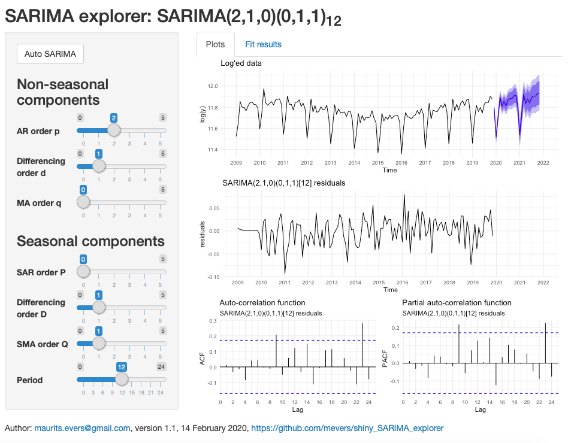

# shiny_SARIMA_explorer

## Screenshot

## Data

Data are monthly passenger airport traffic data for Canberra airport, freely available from the [Department of Infrastructure, Transport, Cities, and Regional Development](https://www.bitre.gov.au/publications/ongoing/airport_traffic_data).

## TODO

- <s>Add fit summary</s>
- Add "auto SARIMA" functionality
- Option to show log'ed and un-log'ed data
- Option to set the number of forecast time units
